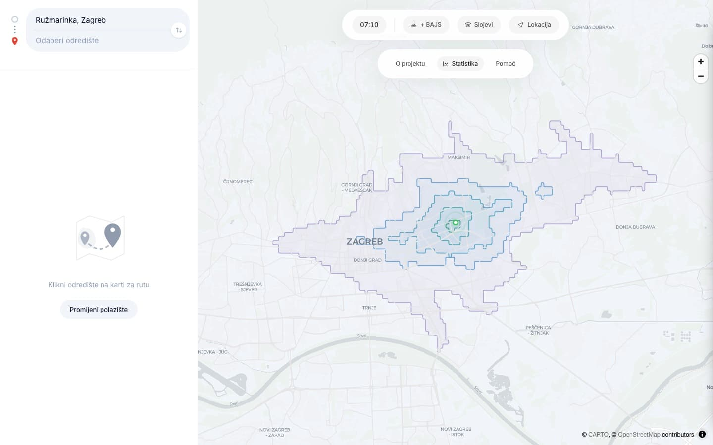
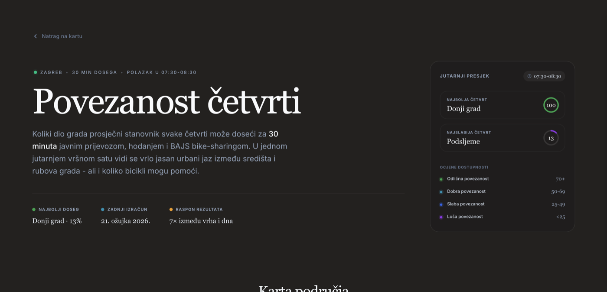

# Doseg

Interactive transit reachability map for Zagreb. Click anywhere to see how far you can travel by tram, bus, and train in 15, 30, and 45 minutes, visualized as color-coded isochrone bands over the city map.



**Key capabilities:**

- **Multimodal isochrones** — tram, bus, train, and BAJS bike-sharing in one routing graph, with elevation-aware walking
- **Instant route preview** — hover any destination to reconstruct the full route client-side, no extra network request
- **Live transit data** — real-time delays from ZET's GTFS-RT feed, vehicle positions, and service alerts
- **District statistics** ([`/statistika`](https://doseg.hr/statistika)) — city-wide transit analytics: district rankings, equity gaps, transit deserts, Gini coefficient, travel time matrix, and downloadable open data



## Architecture

```
                  Cloudflare (CDN + DNS)
                         │
                       Caddy (TLS, compression, security headers)
                      ╱      ╲
               Next.js         Rust isochrone service
            (SSR + APIs)           (axum, port 3001)
                │                       │
                └───── OpenTripPlanner ──┘
                       (GTFS routing)
```

**Caddy** terminates TLS, applies gzip/zstd compression, sets security headers, and routes `/api/isochrone` directly to the Rust service. Everything else goes to Next.js.

**Next.js** handles SSR, the statistics page, OG image generation, GTFS-RT vehicle positions/alerts, and all client-side map interactions (MapLibre GL).

**Rust isochrone service** (`transit/src/isochrone_server.rs`) is the hot path. It computes isochrones and routing graphs for every map click. On startup it fetches the full transit graph from OTP, loads the binary walking graph (~422K nodes, CSR-encoded with SRTM elevation), builds BAJS bike-sharing adjacency, and starts a GTFS-RT background refresh loop.

**OpenTripPlanner** builds and serves the transit routing graph from ZET (tram/bus) and HZPP (train) GTFS feeds.

### How the isochrone engine works

The isochrone endpoint runs Dijkstra over the transit graph (patterns, stops, departures), then expands reachable stops onto the walking graph to generate GeoJSON features bucketed by travel time. It also returns a routing payload (predecessor graph) so the client can reconstruct full routes without additional network requests.

Performance (single-core, release build with LTO):
- **69ms** median single request (Dijkstra + walk expansion + GeoJSON generation + serialization)
- **41 req/s** sustained at 100 concurrent connections
- Previous Node.js implementation: 244ms / 9 req/s

Key design decisions:
- **Coordinate snapping**: origin lat/lon snapped to 3 decimal places (~100m), departure time to 5-minute intervals. This collapses nearby requests into identical cache keys for Cloudflare CDN hits.
- **ts-rs type generation**: response types are defined once in Rust with `#[derive(TS)]` and exported to `lib/generated/*.ts`. The TypeScript frontend imports these directly, so the API contract is enforced at compile time on both sides.
- **GTFS-RT realtime delays**: a background task fetches ZET's protobuf feed every 30 seconds. The Dijkstra loop applies per-stop delay adjustments from the latest snapshot, and the response includes a `realtime` flag so the UI can indicate live data.
- **RT persistence**: every 60 seconds, route-level delay aggregates are written to a SQLite database (WAL mode, separate writer thread). Stop-level delays are sampled every 5 minutes. Data is kept for 1 year raw, then compacted to hourly aggregates. Query endpoints (`/api/rt/history`, `/api/rt/stops`, `/api/rt/alerts`, `/api/rt/summary`) serve historical data. Daily backups to Cloudflare R2 via GitHub Actions.
- **BAJS bike-sharing**: idealized station availability (1 bike, 1 dock always present) integrated into the routing graph as walk + bike edges.

### District scoring CLI

A separate binary (`transit-scorer`) runs 4 scoring passes across all 17 districts (bus+tram, +train, +BAJS, evening off-peak) using parallel Dijkstra via rayon. Outputs `data/district-scores.json` consumed by the `/statistika` page.

## Tech stack

| Layer | Technology |
|-------|-----------|
| Frontend | Next.js 16, React 19, MapLibre GL, Tailwind 4, Motion |
| Isochrone service | Rust, axum, tokio, rayon, ts-rs, prost (protobuf), rusqlite |
| Transit routing | OpenTripPlanner 2.9 with ZET + HZPP GTFS feeds |
| Realtime | ZET GTFS-RT protobuf feed (trip updates + vehicle positions) |
| Bike-sharing | BAJS/nextbike via GBFS API |
| Walking network | Custom binary graph from Croatia OSM extract (~422K nodes, CSR-encoded), SRTM elevation |
| Reverse proxy | Caddy 2 (TLS, compression, security headers, path-based routing) |
| CDN | Cloudflare (coordinate-snapped cache keys) |
| Containers | Docker Compose (4 services: OTP, isochrone, app, Caddy) |
| RT history DB | SQLite (WAL mode), daily backups to Cloudflare R2 |
| CI/CD | GitHub Actions: auto-deploy on push, weekly GTFS data updates, daily RT DB backup |

## Development

### Prerequisites

- [bun](https://bun.sh/) (package manager + runtime)
- [Rust](https://rustup.rs/) (isochrone server)
- [Docker](https://docs.docker.com/get-docker/) (for OTP, or full-stack local)
- [mprocs](https://github.com/pvolok/mprocs) (optional, runs all processes in one terminal)
- [portless](https://github.com/vercel-labs/portless) (optional, gives `https://doseg.localhost` instead of `http://localhost:3000`)

### Quick start

```bash
./scripts/setup-dev.sh
```

This installs dependencies, downloads data files (walk graph, GTFS) from the CDN, and builds the Rust isochrone server. Use `--force` to re-download data files.

Then start everything:

```bash
mprocs
```

This starts 3 processes: SSH tunnel to OTP on the server, Rust isochrone service, and Next.js dev server. Visit `https://doseg.localhost` (requires [portless](https://github.com/vercel-labs/portless)) or `http://localhost:3000`.

<details>
<summary>Without SSH access to the server</summary>

If you don't have SSH access, run OTP locally:

```bash
docker compose up -d otp                   # starts OTP, builds graph (~2 min first time)
docker compose exec otp wget -qO- http://localhost:8080/otp/  # verify it's ready

# In separate terminals:
OTP_URL=http://localhost:8080 DATA_DIR=data PORT=3002 cargo run --release --bin isochrone-server --manifest-path transit/Cargo.toml
bun dev
```

</details>

### Other commands

```bash
bun run typecheck              # type-check without emitting
bun run format                 # prettier
cargo test --manifest-path transit/Cargo.toml  # rust tests
bun run build:walk-graph       # rebuild walking graph from OSM PBF
bun run build:bike-graph       # rebuild bike-sharing graph
```

## Production

```bash
docker compose up
```

This starts 4 services: OTP (builds transit graph on first run), the Rust isochrone server, Next.js, and Caddy. Resource limits are set per service (OTP 1GB, isochrone 512MB, app 768MB, Caddy 256MB).

Pushing to `main` triggers automatic deployment via GitHub Actions (SSH to server, pull, rebuild containers, health check).

## Roadmap

See [ROADMAP.md](ROADMAP.md).
