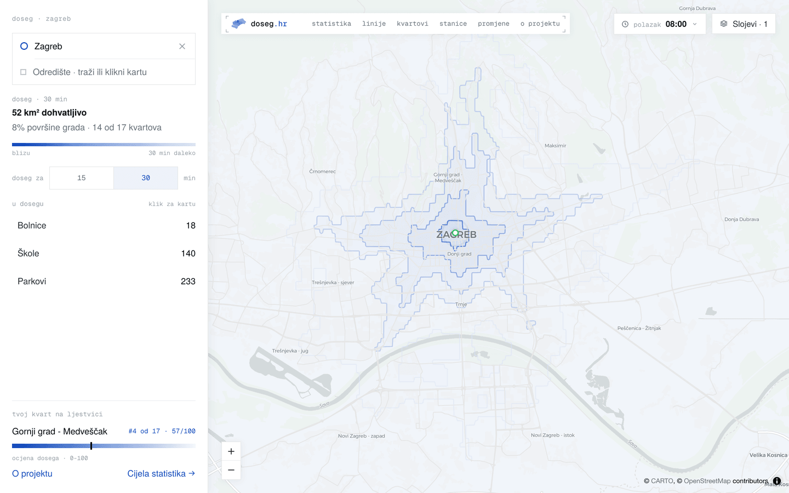
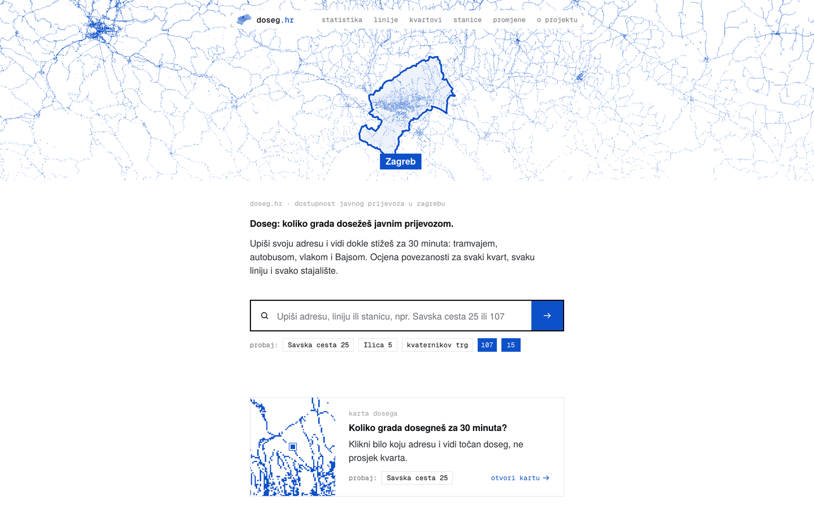
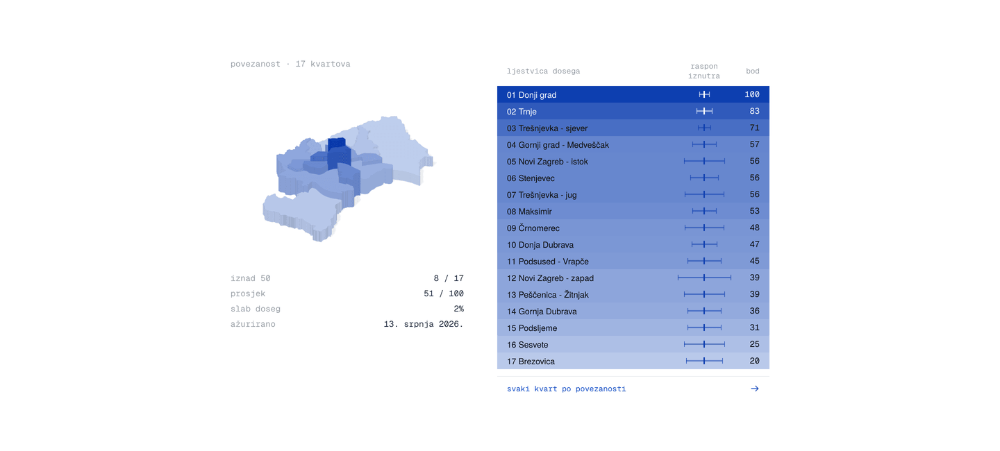
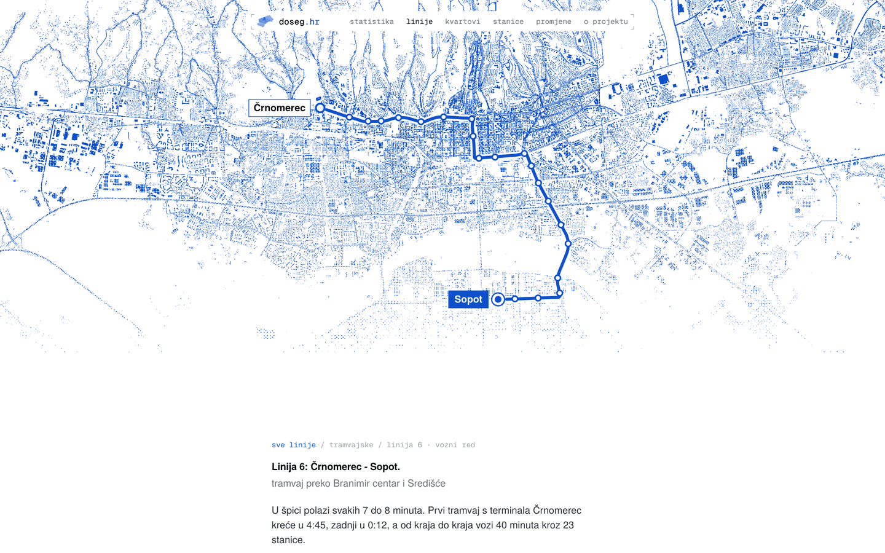
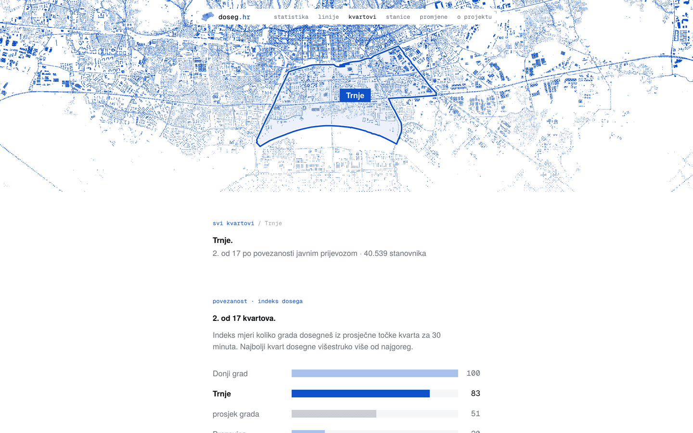

# Doseg

[doseg.hr](https://doseg.hr) measures how much of Zagreb you can actually reach by public transport. Click anywhere on the map and it computes, from the live schedule, which parts of the city are within 15 or 30 minutes by tram, bus, train, and BAJS bike-share.

Around that map sits a directory of the whole ZET network: every line, every stop, every kvart, each with its own page and its own reachability numbers.



## What's on the site

| Route | What it is |
|-------|-----------|
| `/` | The imenik: address/line/stop search over the whole network, plus a directory of the busiest lines and the A-Ž stop index |
| `/karta` | The interactive isochrone map. Deep-linkable via `?lat&lon&t` (departure time), `?dlat&dlon` (destination), `?m` (minutes), `?poi` |
| `/statistika` | Editorial city-wide analysis: the 17 kvartovi ranked by reach, the inequality gap, travel-time matrix, methodology. Deep-dive tables live at `/statistika/podaci` |
| `/linije` + `/linije/[broj]` | 154 line pages: schedule, headway in peak, terminal-to-terminal time, stop list, and a dithered map of the route corridor |
| `/stanice` + `/stanice/[slug]` | 1,220 stop pages: which lines call there, first and last departure, what's reachable from that stop |
| `/kvartovi` + `/kvartovi/[slug]` | 17 district scorecards with the reach index and how the kvart compares to the city |
| `/adresa/[slug]` | Per-street pages built from the DGU address register (5,213 streets, 138k address points) |
| `/promjene` | Changelog of ZET line changes, ingested from ZET's own announcement RSS and illustrated with GTFS geometry |
| `/karta-tramvaja` | Schematic tram network map, London-Underground style |
| `/o-projektu` | How the thing works, in Croatian |









## Architecture

```
                  Cloudflare (CDN + DNS)
                         │
                       Caddy (TLS, compression, security headers)
                      ╱      ╲
               Next.js         Rust isochrone service
            (SSR + SSG + APIs)     (axum, port 3001)
                │                       │
                └───── OpenTripPlanner ──┘
                       (GTFS routing)
```

**Caddy** terminates TLS, applies gzip/zstd compression, sets security headers, and routes `/api/isochrone` and `/api/rt/*` straight to the Rust service. Everything else goes to Next.js.

**Next.js** (App Router) serves the map client, statically generates every line/stop/kvart page from committed JSON, and handles search, geocoding, POI lookups, OG image generation, and GTFS-RT vehicle positions and alerts.

**Rust isochrone service** (`transit/src/isochrone_server.rs`) is the hot path: it computes an isochrone and a routing graph for every map click. On startup it fetches the transit graph from OTP, loads the binary walking graph (~422K nodes, CSR-encoded with SRTM elevation), builds BAJS adjacency, and starts a GTFS-RT refresh loop.

**OpenTripPlanner** builds and serves the routing graph from ZET (tram/bus) and HŽPP (train) GTFS feeds.

The same crate also ships `transit-scorer`, the CLI that generates all the committed page data (district scores, line pages, stop pages) using parallel Dijkstra via rayon.

### How the isochrone engine works

The endpoint runs Dijkstra over the transit graph (patterns, stops, departures), then expands the reachable stops onto the walking graph and buckets the result into GeoJSON bands by travel time. The response also carries a predecessor graph, so the client can reconstruct any route on hover without a second request.

The departure model is the part that took the longest to get right:

- **First boarding**: the exact wait for the next departure, capped at a 120s access buffer. A rider times leaving home to the vehicle; charging half a headway on the first leg gutted sparse-feeder suburbs (the engine claimed 36 min Dubec → Vidovec where a timed departure takes 22).
- **Transfer boardings**: expected wait, i.e. headway/2. Stop offsets in the graph are medians over sampled trips, so boarding the *exact* next departure turned that noise into a lottery: reach swung ±40% between adjacent 5-minute buckets while the real schedule was flat.
- The client-side TS engine that powers the route panel is a deliberate twin of the Rust one. Change one, change both.

Other design decisions:

- **Coordinate snapping**: origin lat/lon snapped to ~100m, departure time to 5-minute buckets. Nearby clicks collapse into the same cache key, so Cloudflare serves most of them.
- **ts-rs type generation**: response types are declared once in Rust with `#[derive(TS)]` and exported to `lib/generated/*.ts`. `cargo test` regenerates them; never hand-edit that directory.
- **GTFS-RT delays**: a background task polls ZET's protobuf feed every 30s; Dijkstra applies per-stop delay adjustments and the response carries a `realtime` flag. Delays are clamped — unclamped RT garbage once poisoned the CDN with wrong isochrones for hours.
- **RT persistence**: route-level delay aggregates are written to SQLite (WAL, separate writer thread) every 60s, stop-level every 5 min, kept a year raw then compacted hourly. `/api/rt/history`, `/api/rt/stops`, `/api/rt/alerts`, `/api/rt/summary` serve it. Daily backups to Cloudflare R2 via GitHub Actions.
- **BAJS**: idealized station availability (one bike, one dock) folded into the graph as walk + bike edges.

Performance: the endpoint emits a `Server-Timing` header, and production currently reports **9-32ms** total server compute per uncached request (`state`, `walk`, `payload`, `serial`). The Node.js implementation this replaced took ~244ms.

## Data pipelines

Committed data comes from the Rust crate, never from parsing GTFS zips in TypeScript.

- `cargo run --release --bin transit-scorer` scores all 17 districts into `data/district-scores*.json`; `--line-pages` and `--stop-pages` write `data/linije/` and `data/stanice/`. Needs OTP on :8080 and the isochrone server on :3002.
- Visual assets come from `scripts/*.ts` (bun): `build-line-heroes.ts`, `build-stop-heroes.ts`, `build-kvart-heroes.ts`, `build-home-hero.ts` turn CARTO tiles into the blue/white dithered maps in `public/`. Runs are incremental; tiles cache in `.cache/`.
- `scripts/build-adrese.ts` builds the address register from the DGU INSPIRE WFS.
- `scripts/promjene/` ingests ZET announcements into the changelog and builds the geometry for each change.
- Prod gets data and images through git → Docker. There is no upload step.

The weekly roll is automated: `update-data.yml` pulls the new ZET feed every Monday, validates that the service window is actually usable, and on the server `refresh-gtfs.sh` rebuilds OTP while `regen-data.sh` regenerates the page data, gates it (`regen-data-gate.py` is fail-closed on collapsed counts or walk-only reach), and pushes it as a PR so the normal deploy bakes fresh pages.

## Tech stack

| Layer | Technology |
|-------|-----------|
| Frontend | Next.js 16, React 19, MapLibre GL, Tailwind 4, Base UI, Motion, visx |
| Isochrone service | Rust, axum, tokio, rayon, ts-rs, prost (protobuf), rusqlite |
| Transit routing | OpenTripPlanner 2.9 with ZET + HŽPP GTFS feeds |
| Realtime | ZET GTFS-RT protobuf feed (trip updates + vehicle positions) |
| Bike-sharing | BAJS/nextbike via GBFS API |
| Addresses | DGU Registar prostornih jedinica (INSPIRE AD WFS) |
| Walking network | Custom binary graph from Croatia OSM extract (~422K nodes, CSR-encoded), SRTM elevation |
| Reverse proxy | Caddy 2 (TLS, compression, security headers, path-based routing) |
| CDN | Cloudflare (coordinate-snapped cache keys) |
| Containers | Docker Compose (OTP, isochrone, app, Caddy, plus a `tools`-profile scorer) |
| RT history DB | SQLite (WAL mode), daily backups to Cloudflare R2 |
| CI/CD | GitHub Actions: auto-deploy on push, weekly GTFS + page-data regen, daily RT DB backup, health watchdog |

Design conventions (two font sizes, colour tokens, sharp corners, Croatian copy rules) are documented in [AGENTS.md](AGENTS.md).

## Development

### Prerequisites

- [bun](https://bun.sh/) (package manager + runtime)
- [Rust](https://rustup.rs/) (isochrone server)
- [Docker](https://docs.docker.com/get-docker/) (for OTP, or full-stack local)
- [mprocs](https://github.com/pvolok/mprocs) (optional, runs all processes in one terminal)
- [portless](https://github.com/vercel-labs/portless) (optional, gives `https://doseg.localhost`)

### Quick start

```bash
./scripts/setup-dev.sh
```

Installs dependencies, downloads the data files (walk graph, GTFS) from the CDN, and builds the Rust isochrone server. `--force` re-downloads.

Then:

```bash
mprocs
```

Three processes come up: OTP on :8080, the Rust isochrone service on :3002, and the Next.js dev server. `scripts/otp.sh` picks the best OTP source automatically — reuse whatever already serves :8080, else an SSH tunnel to production, else local Docker (needs `docker-compose.override.yml` to expose the port).

Visit `https://doseg.localhost` — port 3000 belongs to a different app on the dev machine.

### Other commands

```bash
bun run typecheck              # tsc --noEmit
bun run lint                   # eslint (caps functions at 90 lines)
bun run format                 # prettier
bun run test                   # vitest
bun run build                  # also statically generates every line/stop/kvart page
cargo test --manifest-path transit/Cargo.toml   # rust tests + ts-rs type export
bun run build:walk-graph       # rebuild walking graph from OSM PBF
bun run build:bike-graph       # rebuild bike-sharing graph
bun run build:poi-photos       # refresh POI popup photos (hits Overpass + Wikidata)
```

## Production

```bash
docker compose up
```

Starts OTP (builds the transit graph on first run), the Rust isochrone server, Next.js, and Caddy, with per-service memory limits (OTP 3G, isochrone 512M, app 1.5G, Caddy 256M).

Pushing to `main` deploys automatically via GitHub Actions: SSH to the server, pull, rebuild containers, health check, roll back if it fails.

## Roadmap

See [ROADMAP.md](ROADMAP.md).
